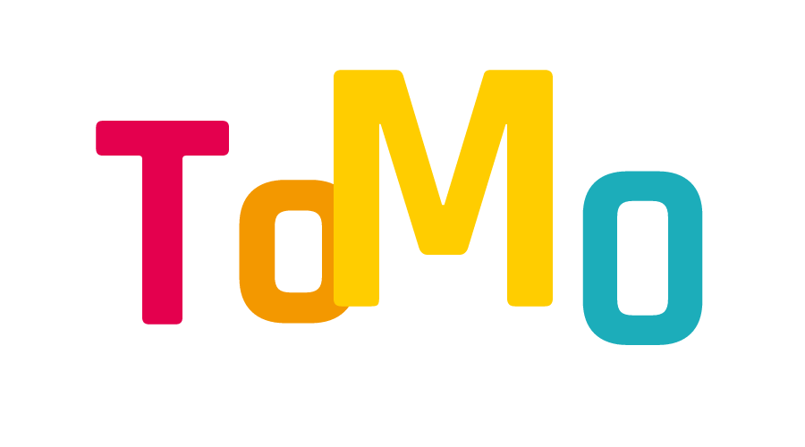

## VUE3.0 + VITE + ELEMENT + MD editor ##
### 初始化vite项目 ###
    npm init @vitejs/app my-vue-app --template vue
### 引入 Element Plus ###
    npm i element-plus
然后修改项目入口文件，引入 Element Plus 库和相关样式文件  
~~~json
import { createApp } from 'vue'
import App from './App.vue'
import ElementPlus from 'element-plus'
import 'element-plus/lib/theme-chalk/index.css'
createApp(App).use(ElementPlus).mount('#app')
~~~
### 引入 makedown editor ###
[参考](https://blog.csdn.net/qq_24392199/article/details/116982316) 
#### 安装 ####
    npm i @kangc/v-md-editor@next -S
#### 引入组件 ####
~~~json
import { creatApp } from 'vue';
import VMdEditor from '@kangc/v-md-editor';
import '@kangc/v-md-editor/lib/style/base-editor.css';
import githubTheme from '@kangc/v-md-editor/lib/theme/github.js';
import '@kangc/v-md-editor/lib/theme/style/github.css';

VMdEditor.use(githubTheme);

const app = creatApp(/*...*/);

app.use(VMdEditor);
~~~
#### 基础用法 ####
~~~json
<template>
  <v-md-editor v-model="text" height="400px"></v-md-editor>
</template>

~~~
